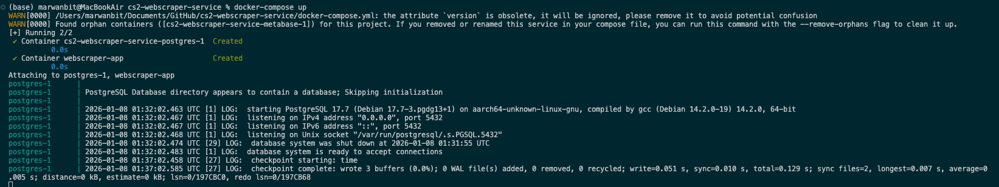
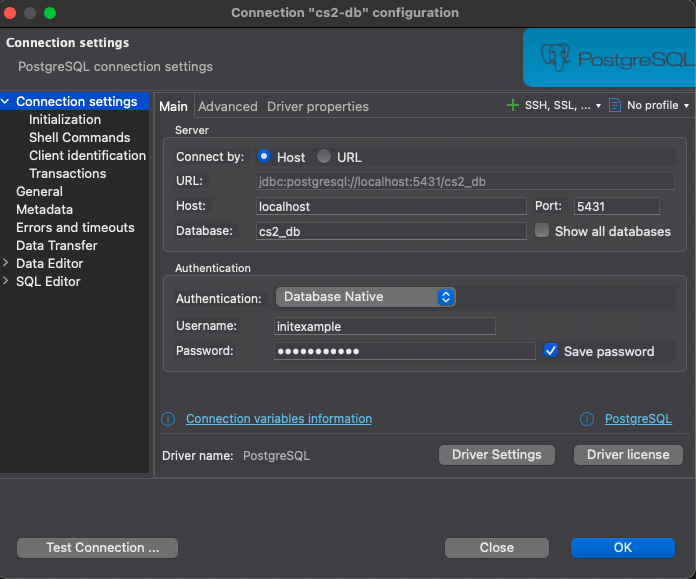

# cs2-webscraper-service

A webscraper that scrapes HLTV and the Pandascore API in order to obtain CS2 Match data.

# Prerequisites

Docker and Docker Compose are required in order to manage and run the services of the webscraper-service. Checkout the following link for instructions on how to install Docker: [https://www.docker.com/get-started/]() .

# Getting Started

To start up the application, start a terminal in the root directory, then run the following command:

```bash
docker-compose up
```

You should see the following logs on your terminal screen indicating that the postgres and python applications have started.



Additionally, if you would like to connect a database viewer (such as **DBeaver**, which we personally recommend), you may use the following information below, as provided by the docker-compose environment variable settings.

```bash
POSTGRES_DB=cs2_db
POSTGRES_USER=initexample
POSTGRES_PASSWORD=initexample
PORT=5431
HOST=localhost
```

This looks like the following settings in **DBeaver:**



Where the password is **initexample** as stated above. Now you are ready to attach to the python application container where you can run commands provided by the webscraper service. To attach to the application container run the following command in a seperate terminal (leaving the long running docker-compose terminal running):

```bash
docker exec -it webscraper-app bash
```

Now you are ready to run commands from the service, which we will describe in later sections!

# Resources

* [Poetry Tutorial](https://medium.com/@sjalexandre/python-tutorial-managing-projects-with-poetry-cd2deab72697)
* [Python Docker Builds With Poetry](https://medium.com/@albertazzir/blazing-fast-python-docker-builds-with-poetry-a78a66f5aed0)
* [Python Development with Docker and Poetry](https://www.youtube.com/watch?v=hXYFS2pOEH8)
