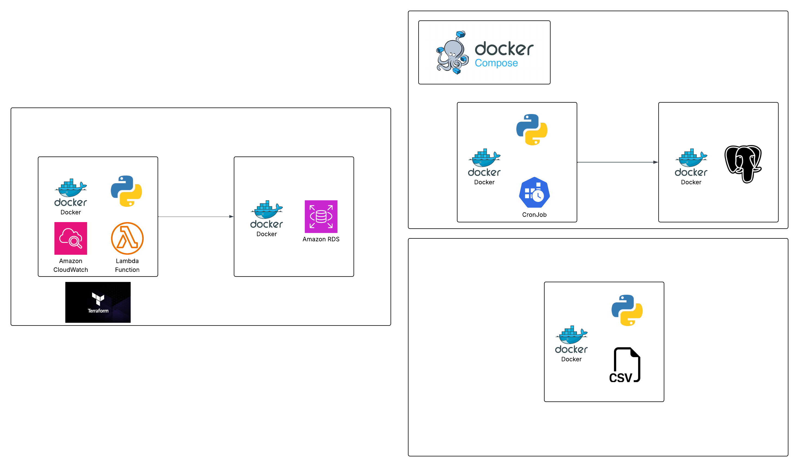
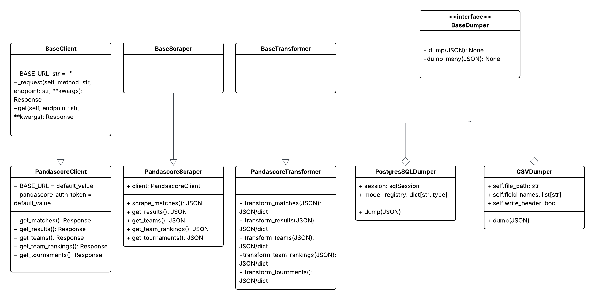

# Architecture Overview

As apart of the **cs2-match-predictor** project, in which we are building a FullStack application on top of an End-to-End Machine Learning Pipeline, we require the ability to obtain and keep up-to-date data on upcoming and ongoing matches in the **CS2 competitive space**. We begin with the observation that a model deployed must have up-to-date data, as the nature of prediction is temporal, the game evolves and thus features that were predictive of outcomes change as the meta changes, meaning our model must always be trained on the most recent match data. This leads us to the following problem: **how can we ensure that we always have access to the most up-to-date match data?**

Our solution is to develop a **cs2-webscraper-microservice**, which scrapes both the Pandascore API and HLTV website in order to obtain and dump the most recent match data into a specified database. We make use of design patterns and object oriented programming principles such as **inheritance, and Dependency Injection (DI)** to ensure that our webscraping application is modular, allowing us to expand the webscraper to other sources in the future, ensuring a clean, adaptable, and upgradable design to fit our future data needs.

We additionally provide scripts for deploying to AWS using **Terraform**, or developing locally through a dockerized postgresSQL database or using local stack. Additionally, we provide a **command line interface** for running the webscraper, alongside **CRON Jobs and AWS Lambda Functions/ AWS Cloudwatch instructions** for scheduling these jobs, in order to ensure that the data is automatically updated and scraped.

## 1. Project Structure

This repository contains the core logic of the webscraper, alongside some configuration files for scheduling CRON jobs and deploying to Terraform. Additionally, we provide useful tools such as a command line interface for interacting with the project, alongside database management, Dependency Injection, etc. Below is a visualization of the project repository, alongside some comments explaining the overall structure of the project.

```markdown
📂 cs2-webscraper-service

├── 📄 README.md

└── 📂 config/			# yaml files for configuring databases, deployment, and productionizing the application.

└── 📂 docs/			# docs including ARCHITECTURE, DEVELOPMENT, DEPLOYMENT, and TESTING files.

└── 📂 src/			# core of the project.

│  └── 📂 webscraper/

│    └── 📂 cli/	     	# folder containing command line tooling for the web-scraper. 

│    └── 📂 core/		# configuration alongside containers for Dependency Injection.

│      ├── 📄 config.py		# config settings for loading environment variables, etc.

│      ├── 📄 container.py	# dependency injection container for managing dependencies, etc.

│      ├── 📄 interfaces.py	# Abstract base classes and interfaces defining contracts for scrapers, repositories, and services.

│    └── 📂 database/		# folder containing DB.

│      ├── 📄 base.py		# Base database classes and mixins for common database functionality.

│      ├── 📄 models.py		# SQLAlchemy models for matches, players, teams, team rankings, tournaments, etc.

│      └── 📂 repositories/	# Repository for model data operations including CRUD and query methods.

│        ├── 📄 match_repository.py

│        ├── 📄 player_repository.py

│        ├── 📄 team_repository.py

│      ├── 📄 session_factory.py 	# Database session factory for creating and managing database connections and sessions.

│    ├── 📄 main.py		# Main entry point for the webscraper service application.

│    └── 📂 scrapers/		# contains the main code for the scrapers.

│      ├── 📄 base.py		# includes interfaces such as BaseClient, BaseScraper, BaseTransformer, BaseDumper.

│      └── 📂 hltv/		# HLTV scraper code.

│        ├── 📄 __init__.py

│        ├── 📄 client.py

│        ├── 📄 scraper.py

│        ├── 📄 transformers.py

│      └── 📂 pandascore/	# Pandascore scraper code.

│        ├── 📄 __init__.py

│        ├── 📄 client.py

│        ├── 📄 scraper.py

│        ├── 📄 transformers.py

│    └── 📂 services/

│      ├── 📄 __init__.py

│      ├── 📄 data_service.py		# Service for managing data operations.

│      ├── 📄 scraping_service.py	# Orchestrates execution, scheduling, and result handling.

│    └── 📂 utils/

│      ├── 📄 exceptions.py

│      ├── 📄 logger.py

│      ├── 📄 rate_limiter.py

└── 📂 tests/

│  └── 📂 fixtures/		# includes sample HTML pages and JSON responses for testing.

│  └── 📂 integration/		# Integration tests.

│    └── 📂 test_database/

│  └── 📂 unit/			# Unit tests.

│    └── 📂 test_repositories/

│    └── 📂 test_scrapers/

│    └── 📂 test_services/

```

## 2. Object-Oriented & High-Level System Diagram (v1.0)

#### High-Level System Design



Above we can see the system design diagram for the application, with three different boxes showing the three different types of deployments. The left most box is the **production/AWS deployment, with terraform for infrastructure orchestration and provisioning,** in which we have a dockerized version of our application running on lambda functions scheduled with Amazon CloudWatch, which dumps to a dockerized **Amazon RDS instance**.

The top-right box shows the **local deployment** of the application, in which we have two docker containers, one containing the dockerized application which runs scheduled **CRON jobs** for scraping, which dumps to a containerized **postgresSQL** docker container. Finally, in the bottom-right we have the **test deployment** in which we dockerize our application and use **CSV** files to test the behavior of our webscraper and it's functionality.

#### Object-Oriented Design



Above we can see the object oriented design for the **webscraper.** We make heavy use of interfaces and inheritance in order to make the code modular, and expandable, as it is designed to make it super easy to write additional webscrapers for additional sites/ sources of data in the future. At the core every **webscraper** is a **pipeline** of the form **Client -> Scraper -> Transformer -> Dumper**, with each of these different classes being responsbile for one step in the scraping process, which we will briefly describe below.

* **Client:** The client is responsible for **Building and sending HTTP Requests, Retry Logic, Rate Limiting, Authentication, Pagination Handling** and subsequently handling responses.
* **Scraper:** The scraper is responsbile for **parsing HTML, extracting fields, clean low-level text formatting, extracting multiple pages if needed, validating presence of required fields.**
* **Tranformer:** The transformer is responsible for **casting types, deduplicating or merging data, validating domain rules, building SQLAlchemy model instances, enforcing referential integrity.**
* **Dumper:** The dumper is responsbile for **inserting into SQL, CSV, parquest JSON, managing DB sessions.**

Notice that our initial design doesn't include the HLTV webscraper, as this will require an additional sprint, in which we will also need a **crawler class**, which we will then expand later as we expand the webscraper's functionality. Additionally, we will write code which will use **Dependency Injection** to determine whether to deploy the local, test, or production environment. In our construction of which Dumper to use we will choose the database session.

## 3. Core Components

1. **cs2-webscraper-service:** A python based webscraper with rate-limiting which scrapes from **HLTV** and the **PandaScore API** in order to dump data into a relational PostgresSQL database, using **Dependency Injection** to ensure a modular design.
2. **cs2-ml-pipeline-service:** An **Amazon Sagemake**r based **ETL pipeline** which takes match data from the relational database managed by the **cs2-webscraper-service** which extracts, transforms, performs feature engineering, trains, and deploys the relevant ML models (making sure the ML models pass accuracy constraints). The pipeline then dumps the model files into an S3 Bucket for model inference.
3. **cs2-backend-service:** A **Django** server (which is deployed as serverless using EC2) which serves the model, alongside allowing access to matches, predictions, users, teams, etc.
4. **cs2-frontend-service:** A **NextJS** Application utilizing Clerk as a service to allow users to sign-up, log-in, create and view predictions, including ML powered predictions.

### 3.1. Frontend

Name: **cs2-frontend-service**

Description: A **NextJS** Application utilizing Clerk as a service to allow users to sign-up, log-in, create and view predictions, including ML powered predictions.

Technologies: **NextJS, React, TailwindCSS, ShadcnUI, Clerk**

Deployment: **Vercel**

### 3.2. Backend Services

#### 3.2.1. cs2-webscraper-service

Name: **cs2-webscraper-service**

Description: A rate-limited Python based webscraper which scrapes HLTV and the Pandascore API in order to populate a relational PostgresSQL Database.

Technologies: **Python, BeautifulSoup, PostgresSQL, psycopg2, Alembic, PyTest, Poetry, Pandascore API**

Deployment: **AWS Lambda Functions, AWS CloudWatch, Docker, LocalStack**

#### 3.2.2. cs2-ml-pipeline-service

Name: **cs2-ml-pipeline-service**

Description: An **Amazon Sagemake**r based **ETL pipeline** which takes match data from the relational database managed by the **cs2-webscraper-service** which extracts, transforms, performs feature engineering, trains, and deploys the relevant ML models (making sure the ML models pass accuracy constraints). The pipeline then dumps the model files into an S3 Bucket for model inference.

Technologies: **Amazon Sagemaker, ScikitLearn, TensorFlow, Pandas, Numpy, Python**

Deployment: **Amazon Sagemaker, AWS Lambda Functions, Amazon CloudWatch, LocalStack**

#### 3.2.3. cs2-backend-service

Name: **cs2-backend-service**

Description: A **Django** server (which is deployed as serverless using EC2) which serves the model, alongside allowing access to matches, predictions, users, teams, etc.

Technologies: **Python, Django, Amazon S3**

Deployment: **Amazon EC2, Docker, Amazon S3, LocalStack, Amazon API Gateway**

## 4. Data Stores

### 4.1. Amazon RDS DB

Name: **cs2-production database**

Type: PostgresSQL

Purpose: Store the raw, normalized data which will be used as the basis for feature engineering and extraction by the **cs2-ml-pipeline-service**. Additionally stores data relevant for the user to obtain on the frontend.

Key Schemas/Collections: teams, matches, results, predictions, maps.

### 4.2. PostgresSQL DB

Name: **cs2-local-database**

Type: **PostgresSQL DB**

Purpose: stores the raw, normalized daa which will be used as the basis for feature engineer and extraction by the **cs2-ml-pipeline-service.** This is used for local development, and is deployed locally on the developers machine.

Key Schemas/Collections: teams, matches, results, predictions, maps.

## 5. Deployment & Infrastructure

Cloud Provider: AWS, Docker (Local Deployment)

Key Services Used: Lambda, CloudWatch, IAM Identity Center, RDS

CI/CD Pipeline: Github Actions, Vercel Deployment

Monitoring & Logging: Prometheus + Grafana

## 6. Development & Testing Environment

Local Setup Instructions: [CONTRIBUTING.md](./CONTRIBUTING.md)

Testing Frameworks: PyTest

Code Quality Tools: Ruff

## 7. Future Considerations / Roadmap

* Architectural Debts
  * Using Clerk as a service makes it difficult to test locally, as the service is third-party and cannot be hosted locally, thus we don't get truly "local" development, attempting to mock Clerk or use some other AWS service for authentication that has a LocalStack equivalent could work. Additionally, thinking of how we can abstract authentication to a seperate service to allow for Dependency Injection maybe a useful approach.
* Major Planned Changes
  * Monitoring using Prometheus and Grafana.

## 8. Project Identification

Project Name: **cs2-webscraper-service**

Repository URL: [cs2-webscraper-service](https://github.com/MarwanBit/cs2-webscraper-service)

Primary Contact/Team: Marwan Bit (marwanbit12@gmail.com)

Date of Last Update: **2025-11-13**
