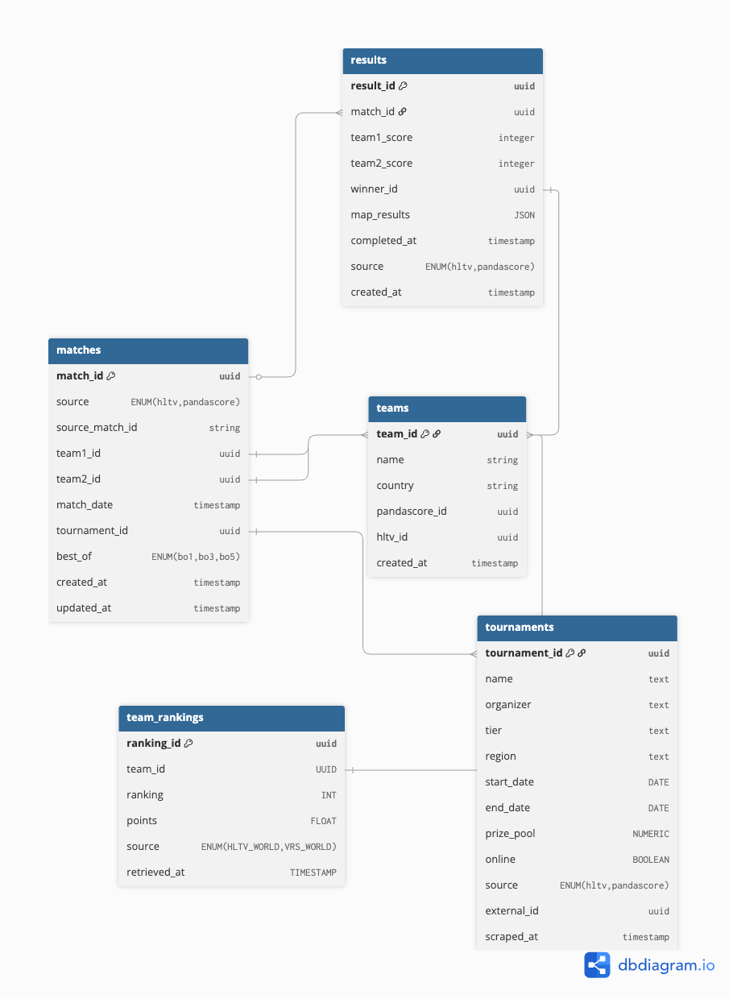

# Database Design (v1.0)

The application utilizes PostgresSQL as the relational database, we model the following entities: **matches, results, teams, tournaments, and team_rankings.** These initial entities and this initial schema provides a simple, normalized, fact-based database which allows us to develop team-level data, such as recent performance, win percentage, prize money won in the last N months, etc.

[](https://github.com/MarwanBit/file-uploader-nextjs/blob/main/docs/api/assets/database_schema.jpeg)

Above you can see a visualization of the five tables in version 1.0 of the postgresSQL relational database. We purposely design the table to enable expanding to more tables to enable more feature-rich feature engineering in the future. For example, adding tables such as **team_aliases, map_stats, player_stats, etc** can help for developing more interesting features, and thus more performant models.

# Design Decisions

The purpose of the given database design is to naturally model the relational nature of matches, teams, tournaments, and rankings in CS2 esports, while providing a normalized fact-driven database serving as a strong foundation for feature engineering and model training in the **cs2-ml-pipeline-service**. The schema supports data from multiple sources (HLTV and PandaScore) and maintains referential integrity through foreign key relationships.

# Database Schema

# matches

Below we will give a brief description of each property of the matches model.

* **match_id:** A unique UUID used to uniquely identify each match in the database.
* **source:** An enumeration indicating the data source (hltv or pandascore) from which the match was scraped.
* **source_match_id:** The original match identifier from the external source system.
* **team1_id:** A UUID foreign key reference to the first team participating in the match.
* **team2_id:** A UUID foreign key reference to the second team participating in the match.
* **match_date:** A timestamp indicating when the match was scheduled or took place.
* **tournament_id:** A UUID foreign key reference to the tournament in which this match was played.
* **best_of:** An enumeration indicating the match format (bo1, bo3, or bo5).
* **created_at:** A timestamp indicating when the match record was first created in the database.
* **updated_at:** A timestamp indicating when the match record was last updated.

# results

Below we will give a brief description of each property of the results model.

* **result_id:** A unique UUID used to uniquely identify each match result in the database.
* **match_id:** A UUID foreign key reference to the corresponding match in the matches table.
* **team1_score:** An integer representing the number of maps won by team1.
* **team2_score:** An integer representing the number of maps won by team2.
* **winner_id:** A UUID foreign key reference to the team that won the match.
* **map_results:** A JSON field containing detailed map-by-map results and statistics.
* **completed_at:** A timestamp indicating when the match was completed.
* **source:** An enumeration indicating the data source (hltv or pandascore) from which the result was scraped.
* **created_at:** A timestamp indicating when the result record was created in the database.

# teams

Below we will give a brief description of each property of the teams model.

* **team_id:** A unique UUID used to uniquely identify each team in the database.
* **name:** The name of the team.
* **country:** The country or region that the team represents.
* **pandascore_id:** The unique identifier for this team in the PandaScore API system.
* **hltv_id:** The unique identifier for this team in the HLTV system.
* **created_at:** A timestamp indicating when the team record was created in the database.

# tournaments

Below we will give a brief description of each property of the tournaments model.

* **tournament_id:** A unique UUID used to uniquely identify each tournament in the database.
* **name:** The name of the tournament.
* **organizer:** The organization or entity responsible for organizing the tournament.
* **tier:** The competitive tier or level of the tournament (e.g., S-Tier, A-Tier).
* **region:** The geographic region where the tournament takes place.
* **start_date:** The date when the tournament begins.
* **end_date:** The date when the tournament ends.
* **prize_pool:** The total prize money available in the tournament.
* **online:** A boolean indicating whether the tournament is conducted online or at a LAN event.
* **source:** An enumeration indicating the data source (hltv or pandascore) from which the tournament data was scraped.
* **external_id:** The unique identifier for this tournament in the external source system.
* **scraped_at:** A timestamp indicating when the tournament data was last scraped from the source.

# team_rankings

Below we will give a brief description of each property of the team_rankings model.

* **ranking_id:** A unique UUID used to uniquely identify each ranking record in the database.
* **team_id:** A UUID foreign key reference to the team being ranked.
* **ranking:** An integer representing the team's position in the ranking (1 being the highest).
* **points:** A floating-point number representing the ranking points or score for the team.
* **source:** An enumeration indicating the ranking system source (HLTV_WORLD or VRS_WORLD).
* **retrieved_at:** A timestamp indicating when the ranking data was retrieved from the source.


# Constraints and Indexes

To maintain data integrity and optimize query performance, the database implements several constraints and indexes across all tables. Below we describe the key constraints and indexes applied to the schema.

## Primary Key Constraints

Each table has a primary key constraint on its main identifier:

```sql
-- Primary keys for all tables
ALTER TABLE matches ADD PRIMARY KEY (match_id);
ALTER TABLE results ADD PRIMARY KEY (result_id);
ALTER TABLE teams ADD PRIMARY KEY (team_id);
ALTER TABLE tournaments ADD PRIMARY KEY (tournament_id);
ALTER TABLE team_rankings ADD PRIMARY KEY (ranking_id);
```

## Foreign Key Constraints

Foreign key constraints ensure referential integrity between related tables:

```sql
-- matches table foreign keys
ALTER TABLE matches 
  ADD CONSTRAINT fk_matches_team1 
  FOREIGN KEY (team1_id) REFERENCES teams(team_id) ON DELETE CASCADE;

ALTER TABLE matches 
  ADD CONSTRAINT fk_matches_team2 
  FOREIGN KEY (team2_id) REFERENCES teams(team_id) ON DELETE CASCADE;

ALTER TABLE matches 
  ADD CONSTRAINT fk_matches_tournament 
  FOREIGN KEY (tournament_id) REFERENCES tournaments(tournament_id) ON DELETE SET NULL;

-- results table foreign keys
ALTER TABLE results 
  ADD CONSTRAINT fk_results_match 
  FOREIGN KEY (match_id) REFERENCES matches(match_id) ON DELETE CASCADE;

ALTER TABLE results 
  ADD CONSTRAINT fk_results_winner 
  FOREIGN KEY (winner_id) REFERENCES teams(team_id) ON DELETE SET NULL;

-- team_rankings table foreign key
ALTER TABLE team_rankings 
  ADD CONSTRAINT fk_rankings_team 
  FOREIGN KEY (team_id) REFERENCES teams(team_id) ON DELETE CASCADE;
```

## Unique Constraints

Unique constraints prevent duplicate records from external sources:

```sql
-- Prevent duplicate matches from the same source
CREATE UNIQUE INDEX unique_source_match 
ON matches (source, source_match_id);

-- Prevent duplicate team identifiers from external sources
CREATE UNIQUE INDEX unique_pandascore_team 
ON teams (pandascore_id) 
WHERE pandascore_id IS NOT NULL;

CREATE UNIQUE INDEX unique_hltv_team 
ON teams (hltv_id) 
WHERE hltv_id IS NOT NULL;

-- Prevent duplicate tournaments from the same source
CREATE UNIQUE INDEX unique_source_tournament 
ON tournaments (source, external_id);

-- Prevent duplicate rankings for the same team and source at the same time
CREATE UNIQUE INDEX unique_team_ranking 
ON team_rankings (team_id, source, retrieved_at);

-- Ensure one result per match
CREATE UNIQUE INDEX unique_match_result 
ON results (match_id);
```

## Performance Indexes

These indexes optimize common query patterns for feature engineering and analytics:

```sql
-- Indexes for time-based queries
CREATE INDEX idx_matches_date ON matches (match_date DESC);
CREATE INDEX idx_results_completed ON results (completed_at DESC);
CREATE INDEX idx_tournaments_dates ON tournaments (start_date, end_date);
CREATE INDEX idx_rankings_retrieved ON team_rankings (retrieved_at DESC);

-- Indexes for team-based queries
CREATE INDEX idx_matches_team1 ON matches (team1_id, match_date DESC);
CREATE INDEX idx_matches_team2 ON matches (team2_id, match_date DESC);
CREATE INDEX idx_rankings_team ON team_rankings (team_id, source);
CREATE INDEX idx_teams_name ON teams (name);

-- Indexes for tournament-based queries
CREATE INDEX idx_matches_tournament ON matches (tournament_id, match_date);
CREATE INDEX idx_tournaments_tier ON tournaments (tier, start_date);

-- Composite index for recent team performance queries
CREATE INDEX idx_matches_team_date ON matches (team1_id, team2_id, match_date DESC);

-- Index for results winner lookups
CREATE INDEX idx_results_winner ON results (winner_id);

-- Index for source-based queries (data quality checks)
CREATE INDEX idx_matches_source ON matches (source);
CREATE INDEX idx_tournaments_source ON tournaments (source);
```

## Check Constraints

Check constraints ensure data validity:

```sql
-- Ensure teams in a match are different
ALTER TABLE matches 
  ADD CONSTRAINT check_different_teams 
  CHECK (team1_id != team2_id);

-- Ensure valid scores
ALTER TABLE results 
  ADD CONSTRAINT check_team1_score_valid 
  CHECK (team1_score >= 0);

ALTER TABLE results 
  ADD CONSTRAINT check_team2_score_valid 
  CHECK (team2_score >= 0);

-- Ensure ranking is positive
ALTER TABLE team_rankings 
  ADD CONSTRAINT check_ranking_positive 
  CHECK (ranking > 0);

-- Ensure points are non-negative
ALTER TABLE team_rankings 
  ADD CONSTRAINT check_points_valid 
  CHECK (points >= 0);

-- Ensure tournament dates are logical
ALTER TABLE tournaments 
  ADD CONSTRAINT check_tournament_dates 
  CHECK (end_date >= start_date);
```

## Rationale

These constraints and indexes serve several important purposes:

1. **Data Integrity**: Foreign keys and unique constraints prevent orphaned records and duplicate data from scraping operations.

2. **Query Performance**: Indexes on frequently queried columns (dates, team IDs, tournament IDs) significantly speed up analytics queries needed for feature engineering.

3. **Data Quality**: Check constraints ensure that scraped data meets basic validity requirements before insertion.

4. **Source Deduplication**: Unique indexes on source + external ID combinations prevent duplicate records when re-scraping the same data sources.

5. **Time-Series Analysis**: Descending date indexes optimize queries for recent match history, which is critical for building time-dependent features for ML models.
